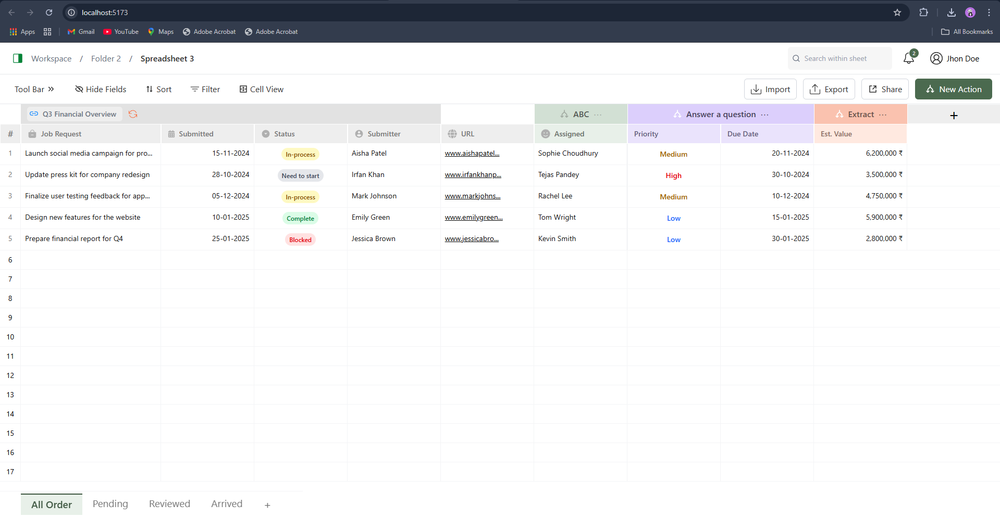

# Workspace Dashboard UI – Internship Assignment

This is a frontend-only React project developed for an internship assignment. The application recreates a clean and professional workspace dashboard UI using **React JS** and **Tailwind CSS**.

---

## 📸 Preview

---

## 🚀 UI Highlights

- 📌 Fixed top toolbar and secondary filter bar
- 📊 Grid layout for displaying job request data
- 🏷️ Colored badges for status and priority fields
- 🖥️ Responsive layout for different screen sizes
- 🔗 Static URLs (non-clickable/dummy links)
- 🎨 Minimal and elegant Tailwind-based styling

---

## 🛠️ Built With

- **React JS**
- **Tailwind CSS**
- `react-icons` for UI icons
